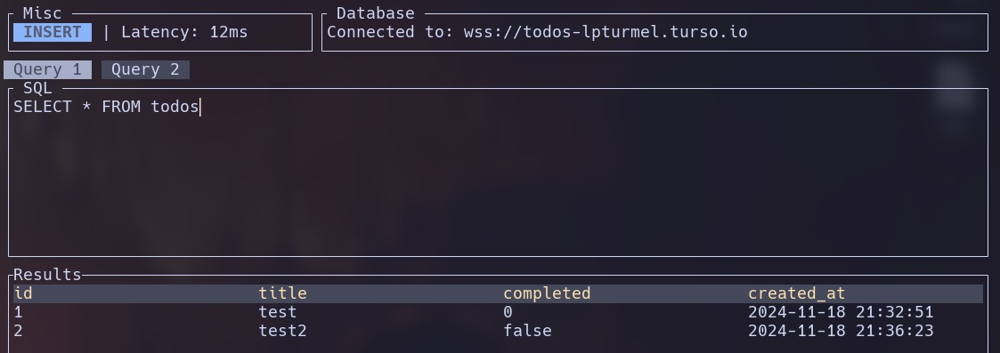

# libsql-tui

A TUI for interacting with [LibSQL](https://github.com/tursodatabase/libsql).

## Usage

`cargo run`

## Key Bindings

| Key | Action |
| --- | --- |
| `i` | Enter insert mode |
| `a` | Move cursor to the end of the char and enter insert mode |
| `q` | Quit |
| `0` | Move cursor to the beginning of the input |
| `$` | Move cursor to the end of the input |
| `c` | Clear the results |
| `r` | Submit the query |
| `h` | Move cursor to the left |
| `l` | Move cursor to the right |
| `D` | Clear the query |

## Screenshot

